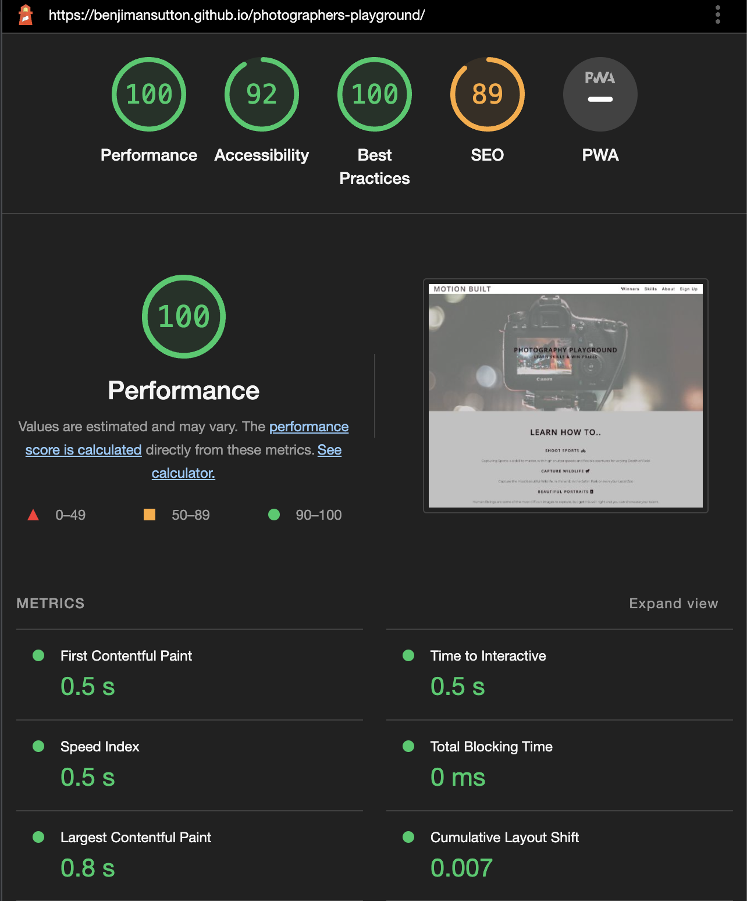

# Motion Built

This project is to help people learn new skills in the world of photography, as an online community and online course we teach people small or large skills. Then they can put themselves forwards for Photographer of the Month, and win awards anything from a Macbook Pro to 1 years worth of Creative Cloud.

## Features

---

This project has multiple different sections to engage the viewer, to help guide them into if they want to get involved.

### Existing Features

- __Navigation Bar__

    - Featured on the two pages, created as a fully responsive navigation bar including the Logo and then linking to the Winners page and the other three to sections on the home page

    - The links allow navigation from one section to the other as a hassle free moment and good user interaction.

    - Any links to other pages are opened in the same page (Winners Page).

    - All images open up on another page to show high resolution image for the user.

- __Landing Page Image__

    - The landing page image has an animation to keep the viewers attention.

    - There is an overlay so the Writing stands out and tells the user what website they are on.

- __Skill's to Learn Section__

    - This is the area that is to show just a few skills that the user of this online course will learn, but also the biggest challenges people face when learning Photography.

    - The idea of this section is to connect with the viewer who wants to learn, and they may want to learn these subjects. They may have been at a sports event or where animals are and tried to capture images, but not got a result like they would want to.

- __Rewards Given out Each Month__

    - As a community I want people to get involved into the monthly challenges, bringing people into the community to share their images and be assessed by Professional Photographers with years of experience.

- __Sign Up Section__

    - The sign up area is here as the first step, to get people involved in the process to learn and start the growth of passion. I wanted it to be quick and simple for the first step.

- __Footer Section__

    - The footer section to help people connect directly with us on any platform we are on. This includes social media links and email.

    - All the social links and email link out.

- __Gallery Page__

    - The gallery page is to show previous winners of the Photographer of the Month awards. This is to spark interest in how these people learnt the skills to capture award winning photographs.

    - This page is responsive on various device sizes.

### Features left to Implement

## Testing

Throughout the creation process I have been using the HMTL Validator to find issues that I may have missed, this has been quite a quick and easy way to find the faults.

The website shrinks down to fit into the different breakpoints, but this doesn't effect the usability of the website or features.

Whilst testing the site I have come across a few issues, which have been fixed.

- Footer - Whilst making the site responsive the footer had a fixed height, which caused issues making it responsive. Removing the fixed height, this resolved the issue.

- Colour issues - A change with the background of the lighter sections from CDD5D1 to B4969B, this resolved the contrast issues with the backgrounds.

- __Validator Testing__

    - HTML
        - As I was using the validator throughout the building process and not just at the end, errors where returned, but they were all changed.

    - Homepage Validator

    

    - Winners Page Validator
    
    

    - CSS
        - No errors were found when passing through the official Validator

    

- __Lighthouse Testing__

    - Lighthouse
        - For testing the SEO, usability and accessibility of this website we used a tool within Dev Tools on Chrome, Lighthouse. This was used for both mobile and desktop testing.
    
    - Desktop Lighthouse Report

    

    - Mobile Lighthouse Report

    

- __Browser Testing__

    - Browser Compatibility

    - Once the project was completed, I went onto testing the site on various browsers.

    - Firefox Browser

    

    

    - Microsoft Edge Browser

    

    

    - Chrome Browser

    

    

    - iPhone Browser

    

    

### Unfixed Bugs

~~The only unfixed bug is an issue with the footer when going below 400px breakpoint and it drops below the viewpoint, I found this at the very last stage and will continue to work on this.~~

- Bug Fixed - 16/2/2022

## Deployment

The site was deployed to GitHub pages. The steps to deploy are as follows: 
  - In the [GitHub repository](https://github.com/benjimansutton/photographers-playground), navigate to the Settings tab 
  - From the source section drop-down menu, select the **Main** Branch, then click "Save".
  - The page will be automatically refreshed with a detailed ribbon display to indicate the successful deployment.

The live link can be found [here](https://benjimansutton.github.io/photographers-playground)

### Local Deployment

In order to make a local copy of this project, you can clone it. In your IDE Terminal, type the following command to clone my repository:

- `git clone https://github.com/benjimansutton/photographers-playground.git`

Alternatively, if using Gitpod, you can click below to create your own workspace using this repository.

 ## Credits

 In this project there are a few creators to reference to which I used for the enhancement of the project.

- __Content__

    - The animation and gallery code was enhanced by the Love Running Project. - https://github.com/Code-Institute-Solutions/love-running-2.0-sourcecode
    - The social media icons, HTML & CSS where supported by Font Awesome and W3S Website. - https://fontawesome.com/
    - Any other Icons where used with Font Awesome - https://fontawesome.com/
    - Gallery layout from W3Schools Website - https://www.w3schools.com/css/css_image_gallery.asp

- __Media__

    - All images across the site where taken from an open source site https://www.unsplash.com

